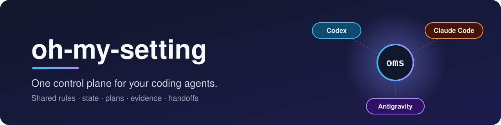
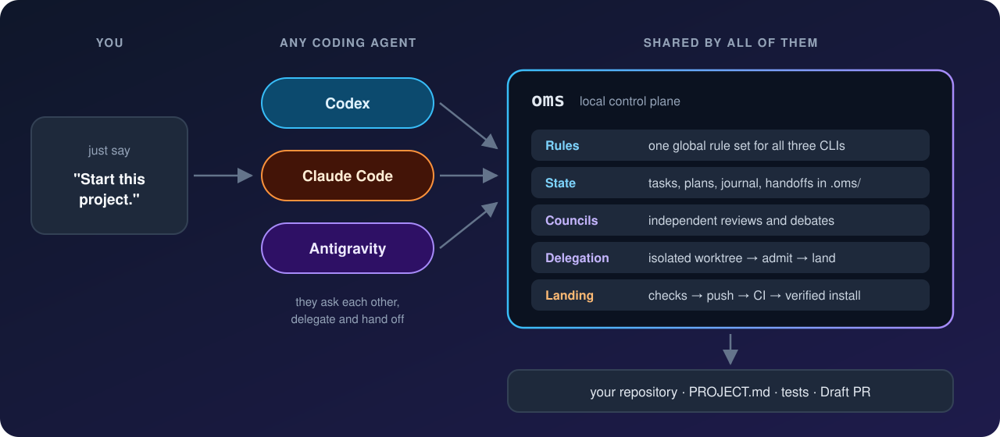

<p align="center">
  
</p>

<p align="center">
  <a href="https://github.com/eightmm/oh-my-setting/actions/workflows/test.yml"></a>
  
  <a href="LICENSE"></a>
</p>

<p align="center"><a href="README.ko.md">한국어</a></p>

**oh-my-setting** lets Codex, Claude Code and Antigravity work on the same
project from the same rules, state, plans, evidence and handoffs, so any of
them can pick up where another left off.

**You never run any of it.** Install once; after that the harness belongs to
your agent. It calls the `oms` tools, writes the `.oms/` state, and handles
updates and health checks when you ask. A command shown here is what the
agent will run, not something you type.

## Install

```bash
curl -fsSL https://raw.githubusercontent.com/eightmm/oh-my-setting/main/install.sh | bash
```

| Host | Needs |
|---|---|
| Linux, WSL (glibc) | Bash, curl. Git, tar, gzip and find are installed if missing. **No Python needed.** |
| macOS | Bash, curl, Command Line Tools (`xcode-select --install`). **No Python needed.** |
| Windows (Git Bash) | Git, Python 3.9+, and native Node.js when a Node-based agent is selected |

The default `core` profile installs the harness and one coding agent.
Profiles, updates, Windows notes and what the installer changes on your
machine are in [docs/INSTALL.md](docs/INSTALL.md). musl-based Linux such as
Alpine is not supported.

## How it works

<p align="center">
  
</p>

Open your coding agent in any directory (empty, mid-project or ongoing) and
say:

```text
Start this project.
```

An empty directory gets a short spec interview, a `PROJECT.md` and a
template. An existing repository is inspected first and interviewed only for
gaps. An ongoing project gets a status report and the next step. From a
confirmed `PROJECT.md`, the agent can carry work through reviewed tasks,
checks and a Draft PR. Generated work never approves itself, and merge and
release stay your call.

## What you can say

```text
Start this project.
Run a peer review of the current diff.
Ask all three models with one debate round: vector DB or pgvector?
Delegate this to codex: add input validation to scripts/train.py.
Take this confirmed PROJECT.md through implementation to a Draft PR.
Check this dataset's group split for leakage before I train.
Wait for Slurm job 12345, then digest its log and report.
Update oh-my-setting and re-run its doctor.
```

## What's inside

| | |
|---|---|
| **Shared rules** | One global rule set for all three CLIs, plus `general`, `ml` and `slurm` project templates |
| **Councils** | Independent multi-model reviews and debates; judging seats get a read-only, bounded view |
| **Delegation** | Isolated worktree workers, an admission gate and one landing path; no recursive delegation |
| **State and handoff** | Work Journal, attention inbox, handoffs before compaction, failure ledger |
| **Verified landing** | One gate, push only while the tree is unchanged, CI, then the install updates to that commit |
| **ML and HPC** | Reproducible runs, leakage checks, Slurm and GPU queue helpers |
| **Typed runtime** | Task contracts, evidence coverage, bounded context, portable capsules ([docs/OMS-RUNTIME.md](docs/OMS-RUNTIME.md)) |

Your agent finds these on its own; the full catalog is in
[docs/COMPONENTS.md](docs/COMPONENTS.md).

## Notes

- **Local-first.** Local files and CLIs by default; connectors only when asked.
- **Nothing private is committed.** Tokens, private data and machine details
  stay out of git; per-project agent files are ignored locally.
- **Reversible.** `oms uninstall` restores the files it replaced.

If it helps, a ⭐ on [GitHub](https://github.com/eightmm/oh-my-setting) is appreciated.
